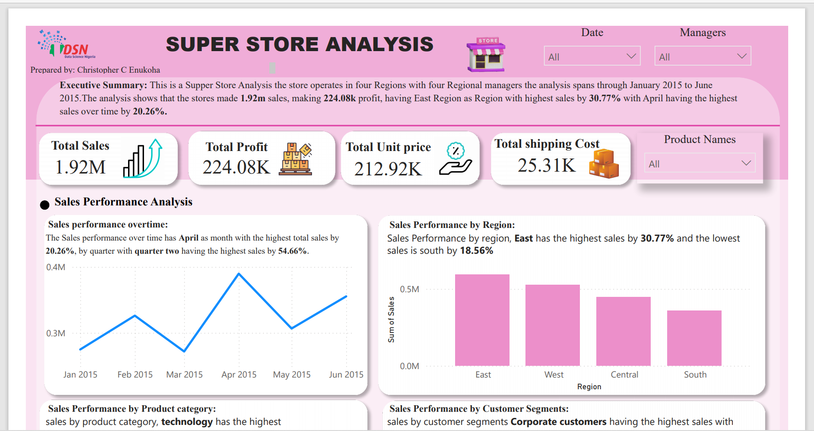
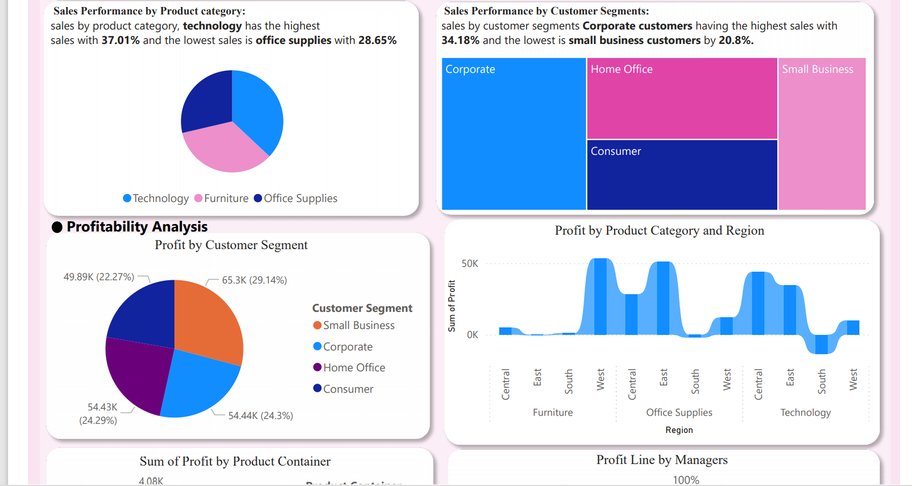
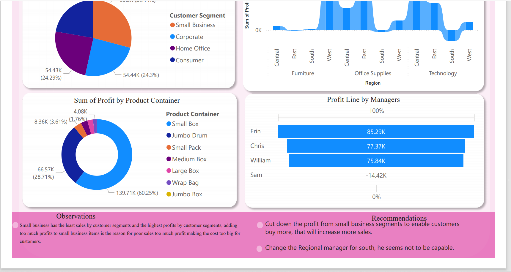

# Supper_Store_Analysis

## Introduction: 
This is a Supper Store Analysis the store operates in **four Regions** with **four Regional managers** the analysis spans from **January 2015 to June 2015**. The analysis shows that the stores made **1.92m sales,** making **224.08k profit**, having **East Region** as the Region with the **highest sales by 30.77%** with **April** having the highest sales over time by **20.26%.**

## Problem Statement:
This project on the Super Store sales data tends to identify top-performing regions, managers, and products based on the different categories for effective decision-making.

## Skills Demonstrated:
The skills demonstrated in this project include the excellent use of PowerBI to perform 
1.	Data Cleaning 
2.	creation of KPIs and Visualization.
3.	Statistical Analysis

## Data Sourcing:
The data for the project was provided by **Data Science Nigeria**

## Analysis:
This is a single-page analysis.

## Key Insights from the Analysis 

 Sales performance over time: 
1) the store had the highest sales in April with **20.26%** 
2) The store made the highest sales in quarter two with **54.66%**
   
 Sales Performance by Region:
1) East has the highest sales at **30.77%**
2) South has the lowest sales at **18.56%**

 Sales Performance by Product Category:
1) Technology has the highest sales with **37.01%**
2) The office supplies have the lowest sales with **28.65%**

 Sales Performance by Customer Segments:
1) Corporate customers have the highest sales with **34.18%** 
2) small business customers have the lowest by **20.8%.**

## Observation
1) Small businesses exhibit the lowest sales among customer segments but generate the highest profits. The excessive profit margins on small business items result in higher prices, leading to poor sales as the costs become too prohibitive for customers.

## Recommendations
After careful analysis of the dataset, I made the following recommendations:
1) Reduce the profit margins for small business segments to make prices more attractive and boost sales. Additionally, replace the Regional Manager for the South, as their performance appears inadequate.

# Infograhphic View 

## Conclusion:
This project was completed by __Christopher C Enukoha__  **Copy_right_2024**
